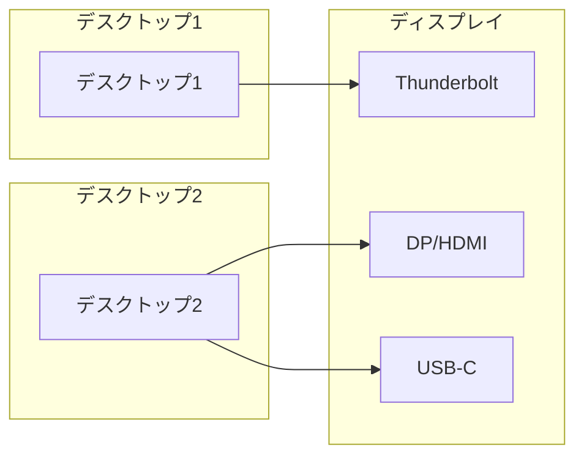
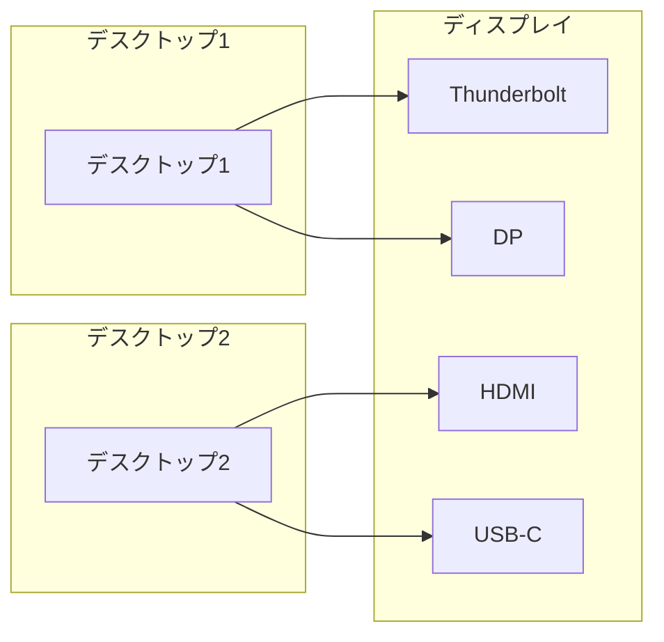

---
# Feel free to add content and custom Front Matter to this file.
# To modify the layout, see https://jekyllrb.com/docs/themes/#overriding-theme-defaults
title: DELL 5K2Kウルトラワイドモニター U4025QW 
layout: single
date:   2025-1-25 21:00:00 +0900
toc: true
categories: item
tags:
 - mionitor
header:
  teaser:
description: 
---

今までmacのマシンを27インチモニター3枚で利用していたが，デスクをL字にするのに合わせて新しいモニターを購入した．今回特にウルトラワイドモニターを試そうということで，DELLの40インチ5K2KモニターU4025QWを購入し，半年程度使ってきたので一回レビューを残す．

# 40インチのウルトラワイドモニター

---

デスクに新しいモニターを追加するにあたって，macで使っているような27インチ×3のようなモニターをたくさんつなぐ構成はPCへの負荷が高く，通常会社で支給されるような非力なマシンだと動かないということで，モニターの枚数を減らしつつ作業スペースを確保するためにウルトラワイド1枚，通常のモニタ1枚の2枚構成とすることにした．ウルトラワイドでよく使われるのは34インチ，38インチ，40インチで，実際に店に見に行った結果40インチくらいはほしいということになった．DELLからU4924DWという49インチのモニターも出ているが，ここまでくると横幅が広すぎて隣に2枚目のモニターをつなぐのが厳しい．ということで40インチに定めて商品選びを行った．40インチの5K2Kモニターは，ドットピッチが0.1815 × 0.1815 mmで，これは31.5インチ4Kモニターの0.182× 00.182 mmとほぼ同等なので2枚並べて使っても違和感がないだろうというのも40インチ5K2Kのスペックが自分の用途にあっていた一つの理由だ．

40インチのウルトラワイドモニターは解像度が5K2Kの5120*2160のものと，もっと解像度が悪いUWQHD（3440*1440）のものがある．最初から5K2Kのものしか検討していなかったのだが，思ったより選択肢は少なく，調べた限りだとDELLとLGのものしか見つからなかった．

- LG：40WP95C-W
- DELL：U4025QW

ちょうど購入を検討していた2024年の5月頃，数ヶ月前に出た新商品として話題になっていたのがDELLのU4025QWだったのでこれを購入した．購入時はセール等もあり23万円+ポイント2万円分で，実質21万円程度で購入できた．2025年1月現在，値上げもあり公式サイト価格は256800円となっている．一方でLGのものは17万円程度で購入できるため，40インチ5K2Kを選ぶときは価格差も考慮するのが良さそうだ．

# U4025QW スペック

---

U4025QWは20万円以上するだけあって機能も多彩に用意されている．[公式ページ](https://www.dell.com/ja-jp/shop/dellデジタル-ハイエンド-シリーズ40曲面thunderbolt-ハブ-モニター-u4025qw/apd/210-bmcw/モニター-モニターアクセサリー?_gl=1*1ekjirq*_up*MQ.._gsMQ..&gclid=EAIaIQobChMIvo-ImPDJigMVztdMAh3NIBFkEAAYASAAEgJRgPD_BwE&gclsrc=aw.ds#techspecs_section)のものをまとめ直したのが以下の表だ．

| 項目 | 仕様 |
| --- | --- |
| 画面サイズ | 40インチ 21:9 |
| 解像度 | 5120 × 2160 |
| ドットピッチ | 0.1815 × 0.1815 mm |
| リフレッシュレート | 120Hz |
| コントラスト | 2000:1 |
| 輝度 | 450 cd/m2（標準）600 cd/m2（HDRピーク） |
| パネル | IPS Blackパネル（非光沢） |
| 湾曲率 | 2500R |
| HDR対応 | 対応 |
| 応答時間 | 通常 8ms、高速 5ms |
| 色域 | DCI-P3 99%sRGB 100% |
| 入力 | HDMI 2.1（5K120Hz）DP 1.4（HDCP 2.3、5K120Hz）Thunderbolt 4 USB-C（DP 1.4 Alt mode） |
| KVM機能 | 2系統 |
| LAN端子 | あり（2.5Gbps） |
| サイズ（モニター部分） | 幅 946.62mm × 高さ 419.44mm × 奥行き 108.04 mm |
| 奥行き | 108.04 mm |
| 重量（パネルのみ、VESAマウントに対応） | 8.35 kg |
| 内蔵スピーカー | 9Wスピーカー、2個 |
| デイジー チェーン機能 | 対応 |
| **PbP/PiP** | 対応 |

画質についてはリフレッシュレート120Hzと，コントラスト比が2000:1に対応したところがLGの競合モデルとの大きな違いだ．これらは通常のコーディング等の用途でどこまで違いが大きくわかるかは不明だが，ゲームをやりたい場合やグラフィック系統のことをやりたい場合には大事かもしれない．また，輝度が標準で450cd/m2と高めになっているのも特筆すべき点で，今までの経験的には輝度が高い方が圧倒的に見やすい．

物理特徴については2500Rの湾曲モニターになっている点が挙げられる．2500Rはかなり緩やかな湾曲具合で，後述するように私は実際に使っていて気になることはなかった．湾曲モニターゆえ奥行きは少し大きめの10cmあるので，デスクの奥行きも大きめの方が良いだろう．もっとも，40インチのモニターを使うには50cmくらいはあったほうがよく，それであれば全く問題なく使える．VESAマウント（100 mm x 100 mm）にも対応していて，重量8.35kgはエルゴトロンLXの積載範囲に収まっている．ただし，LX自体はモニタサイズ34インチまでということにはなっている．

地味にスピーカー内蔵で出力も9W×2なので下手なノートPCよりは高性能な場合がある．一方でカメラは非内蔵なのでweb会議をする場合は追加で準備が必要だ．

入出力の端子は，背面の固定ポート群に加えて，全面にポップアップ式のポートが3つある．端子は以下の通り．

- 背面ポート
    - 画像
        - 1*HDMI
        - 1*DP 1.4
    - Thunderbolt
        - 1* Thunderbolt4 アップストリーム
        - 1* Thunderbolt4 ダウンストリーム（デイジーチェーン対応）
    - USB
        - 1* USB-C アップストリーム
        - 4* USB-A ダウンストリーム ポート（SuperSpeed USB 10 Gbps、USB 3.2 Gen2）
    - 音声
        - 1*ライン出力
    - LAN
        - 1LANポート（2.5GbE）
- 前面ポート
    - 1 USB Type-Aダウンストリーム ポート（SuperSpeed USB 10 Gbps、USB 3.2 Gen2）、BC1.2充電対応
    - 2 USB Type-Cダウンストリーム ポート（SuperSpeed USB 10 Gbps、USB 3.2 Gen2）、充電対応(15W)

アップストリームのthunderbolt4は140Wの給電に対応し，通常のノートPCは十分に充電できる．背面のUSB-Cポートはアップストリームの一つしかない点に注意が必要。HDMIやDPで繋ぐ場合はこのポートは潰れるため、この場合は背面にUSB-Cは残らない。同様にHDMI, DP, thunderboltの全てにPCをつなぐこともできない。最大でも接続できるPCは2台だ。しかしこの点を除けばハブとしての機能を十分に果たせるだけのポートがある。また，2台のPCでのKVMスイッチおよびピクチャインピクチャ，ピクチャバイピクチャに対応している．ダウンストリームにthunderbolt4を備えておりデイジーチェーンにも対応している．

# U4025QW 開封

---

箱が大きすぎて玄関からデスクに運ぶのも一苦労だった．





内容物はディスプレイ，スタンドとケーブル各種．ケーブルは以下の通りで，一通りPCとモニターをつなぐのに必要なものは揃っている．Thunderbolt4のケーブルが1.5mと長めなのが嬉しい．

- 電源ケーブル
- DisplayPort 1.4ケーブル - 1.8 m
- USB A - USB C Gen 2ケーブル - 1 m
- Thunderbolt4 アクティブ ケーブル - 1.5 m
- HDMI 2.1ケーブル - 1.8 m

スタンドはかなり大きいが，作りはしっかりしていてデスクに置いてもあまり悪目立ちしない良いデザインだと思う．ただし，このスタンドは上下左右の角度調整はできるもののモニター高さの調整が全くできない．高さが自分に合わないと感じたら素直にモニターアームを設置するのが良い．

ディスプレイ本体だけの写真を取るのを忘れてしまったので，付属スタンドを利用したデスク（140cm*60cm）への設置後の写真をとった．横にあるのがflexscan EV3240Xで，高さがほぼ同じなのがわかると思う．幅140cmのデスクでもこの2枚ならギリギリ収まるくらいだった．ディスプレイの湾曲は正面体と意識しないとわからない程度だ．

モニターを横から見ると緩やかに湾曲しているのが見て取れる．

左下のポップアップ式のUSBポートはタイプC２つとタイプA一つ．背面のポートは前からだとかなりアクセスしにくいので，USBメモリなどを刺すときはここを利用するのが良い．

# 操作性

---

本体の操作は背面左下にある電源ボタン，およびスティック型OSDコントローラーで行う．コントローラーは結構しっかりした作りでクリック感も固めで，EIZOのflexscan EV3240Xよりは好みの操作性だ．入力ソースの変更，画質設定，音声設定を行える．また，これらの操作はDELL display managerからソフトウェア上でも可能である．実際上はこちらの方が便利で，例えばPCの切り替えはDell Display Managerでホットキーの設定が可能だ．また，片方のPCを電源OFFした場合も、自動的に入力を切り替える機能をONにしておけば、信号の入力がある端子に切り替わる．そのため，実用上はほぼコントローラーを使わなくてもすむ．

設定は入出力をはじめ，色味や音量など多岐にわたる．

# PC2台の接続とKVMスイッチ

---

KVMスイッチは特に気にすることなく，2台のPCを映像・USBアップストリームポートに接続し，ダウンストリームポートに使いたいUSB機器を接続すれば利用できる．キーボード・マウスにとどまらず，USBカメラやLANポートも自動で切り替えが効くため応用の幅は広い．

PC2台の接続パターンはいくつか考えられる．まずPC1台がthunderbolt4に対応していればthunderbolt4で接続し，もう一台のPCはDP/HDMI+USB-Cで接続するパターンがありえる．

次に，PCがいずれもthunderbolt4に対応していない場合は，thunderboltをUSBアップストリームとして利用する．USBのアップストリームポートをThunderboltとUSB-Cのどちらに紐付けるかをコントローラーから自由に設定できる．

また，通常のKVMと別にDell Display Managerを利用したネットワークKVMもサポートしている．これはbluetooth接続のマウスなどを使う際には便利だろう．

PC2台の画面を同時に投影する，ピクチャインピクチャ（PiP）とピクチャバイピクチャ（PbP）も物理コントローラーまたはDisplay Managerから設定できる．分割の割合も細かく設定できるほか，KVMと合わせてPC間でのドラッグ&ドロップによるデータコピーにも対応している．2台のPCを同時にいじりたい場合は非常に便利である．

# DELL Display Manager

---

DELLが提供するDELLモニター用のソフトウェア．windows用は[このページ](https://www.dell.com/support/home/ja-jp/product-support/product/dell-display-manager-2.0/drivers)からダウンロードできる．名前はwindows用がDell Display Managerで，mac用はDell Display and Peripheral Managerという名前で[ここから](https://www.dell.com/support/home/ja-jp/drivers/driversdetails?driverid=rfn2d&oscode=mac1&productcode=u4025qw-monitor)ダウンロードできる．機能の詳細は[公式ページ](https://www.dell.com/support/kbdoc/ja-jp/000060112/dell-display-manager%E3%81%8A%E3%82%88%E3%81%B3dell-peripheral-manager%E3%81%AE%E3%82%BB%E3%82%AD%E3%83%A5%E3%83%AA%E3%83%86%E3%82%A3-%E3%82%B5%E3%83%9D%E3%83%BC%E3%83%88-%E3%83%9D%E3%83%AA%E3%82%B7%E3%83%BC)を参照のこと．ここではいくつか便利な機能をピックアップするに留める．

## ホットキーによるPC切り替え

---

インプットマネージャータブでPC切り替えのホットキーを設定できる．物理コントローラーを使うよりはるかに便利なのでこのホットキーは是非設定したい。

一つのポイントとして，接続する2台のうち片方にDisplay Managerがインストールされていればこの機能を使える点が挙げられる．例えば社用PCと個人PCがあり，制限によって社用PCにはインストールできなくても，個人PCにさえインストールしておけばPC切り替えは利用可能だ．

## ネットワークKVM

---

ネットワークKVMは、通常のUSB KVMとことなり，ネットワーク上の他のPCへの接続を可能にする機能だ．例えばBluetooth接続のワイヤレスキーボード，マウスを利用するとき，ネットワークKVMであればシームレスにモニターの映像入力を切り替えられる．さらに，ネットワークKVMならばPC間でのファイル転送も可能になる．

# U4025QWとエルゴトロンLXの接続

---

モニタアームとしてエルゴトロンLXを選んで設置してみた．エルゴトロンLXは積載重量3.2-11.3kgと重量的にはU4025QWに対応しているが，モニタサイズが34インチまで推奨となっており，この点でU4025QWは本来よろしくない．追々ちゃんと対応したものに交換するとして，一旦余っていたエルゴトロンLXと接続した．最近エルゴトロンのモニターアームも値上がりが激しく、なかなか気軽に買えなくなってしまった、、、 これはあくまで個人的な推測だが，エルゴトロンのデュアルディスプレイ用LXは40インチまでサポートしているので，ポールのデスクへの固定部のトルク耐性の問題で34インチまで推奨としているのではないかと思う．今回試してみて，アーム自体はしっかりとU4025QWの重さに耐えられた．

モニターアームとモニターを接続するときは私はいつもエルゴトロンのクイックリリース ブラケットを噛ませている。3000円程度で，これがあると後々モニターアームを変えるときにアームとモニターを簡単に切り替えられて便利だ。

机とモニターアームの間にもモニターアーム用の保護プレートを噛ませて机への負荷を極力減らす。この手のプレートはamazonで色々売られている。今回はエレコムのモニターアーム補強プレート（DPA-RP01BK）を2000円しない程度で購入した．ある程度しっかりしていて，かつデスクへの傷を防げるようにデスクと接する面に保護剤がついている．

モニターが重いのでアームのネジ強度を強くしてモニターの固定に成功した。ネジはかなり回さないとだめだったので，ここは頑張りどころ．重量的には許容範囲だけあって固定はかなりしっかりしていて安心した。見た目もスッキリするし，何より高さ調整が自在にできるので体への負担がだいぶ違う．

しばらくはこの組み合わせで運用し、タイミングを見計らってより強力なアームに交換しようと思う。

# 半年程度使った感想

---

2024年5月に購入してから早半年以上が経過しているので，最後に現時点での感想を認めておく。基本的には買ってよかったという感想で、40インチ5K2Kというスペックが性に合ってかつ価格が許容できれば多くの人におすすめできる。

40インチの大画面はやはり素晴らしく、作業範囲をかなり広く取れる。通常の27インチモニターはおよそ幅60cm×高さ34cmで、本モニターは幅でその1.5倍あり、通常のデスクワークには十分なスペースがある。2500Rのカーブは使ってみるとあったほうが画面の端まで見やすく、一方で使っていて湾曲を意識させない良い塩梅だ。

画質の面ではコントラストや色、輝度なども半年使って特に不満なく、画面の反射もかなりよく抑えられている印象だ。この辺は並べて使っているEIZOのモニターと実用上大きな違いはないと思う。環境光センターによる輝度の自動調整に加えて、モニターの色温度も5000Kから10000Kまで調整できるのも便利で、長時間使っても疲れにくい。

最後に、40インチ5K2Kというスックについて。今回はそもそも27インチ3枚には出力できないPC用に新しく環境を用意するという目的だった。半年使ってみて，PCのスペック的に1枚のモニターにしか接続できない場合，ウルトラワイドは強い味方になると感じた。標準的な27インチや32インチのモニターに比べると使っていて明らかに画面面積の広さの恩恵を実感できるし，幅が広いので画面分割やPbPもより自然なアスペクト比で使える。

一方で、複数ディスプレイを接続できる場合はそちらの方が便利に使えるかなと思う。純粋に27インチ4Kを2枚の方が作業面積を確保できる上、配線は複雑にはなるがUSBポートの数も多く確保できるケースが多いだろう。

32インチ4K+40インチ5K2Kのデュアルディスプレイは当初の想定通りピクセルサイズがほぼ同じため自然に使えておすすめできる。EIZOとDELLでメーカーが違っても個人的には違和感なく使えている。最近DELLから新しい4Kディスプレイ(Dell デジタルハイエンド32 4K Thunderbolt™ ハブ モニター)も発表されたので、DELLで揃えたい場合は発売を待っても良さそうだ。

# 参考文献

---

[https://review.pastime.ne.jp/personal-computer/computer-gear/dell-u4025qw/](https://review.pastime.ne.jp/personal-computer/computer-gear/dell-u4025qw/)

[Dell U4025QWのサポート マニュアル Dell 日本](https://www.dell.com/support/home/ja-jp/product-support/product/u4025qw-monitor/docs)

[Dellデジタル ハイエンド シリーズ40インチ曲面Thunderbolt™ハブ モニター - U4025QW Dell 日本](https://www.dell.com/ja-jp/shop/dell%E3%83%87%E3%82%B8%E3%82%BF%E3%83%AB-%E3%83%8F%E3%82%A4%E3%82%A8%E3%83%B3%E3%83%89-%E3%82%B7%E3%83%AA%E3%83%BC%E3%82%BA40%E6%9B%B2%E9%9D%A2thunderbolt-%E3%83%8F%E3%83%96-%E3%83%A2%E3%83%8B%E3%82%BF%E3%83%BC-u4025qw/apd/210-bmcw/%E3%83%A2%E3%83%8B%E3%82%BF%E3%83%BC-%E3%83%A2%E3%83%8B%E3%82%BF%E3%83%BC%E3%82%A2%E3%82%AF%E3%82%BB%E3%82%B5%E3%83%AA%E3%83%BC?_gl=1*1ekjirq*_up*MQ)

[モニターはデュアルからウルトラワイドの時代へ。同梱ソフトも使えばさらに快適となる極意を紹介！  [Sponsored]](https://pc.watch.impress.co.jp/docs/topic/special/1645607.html)
