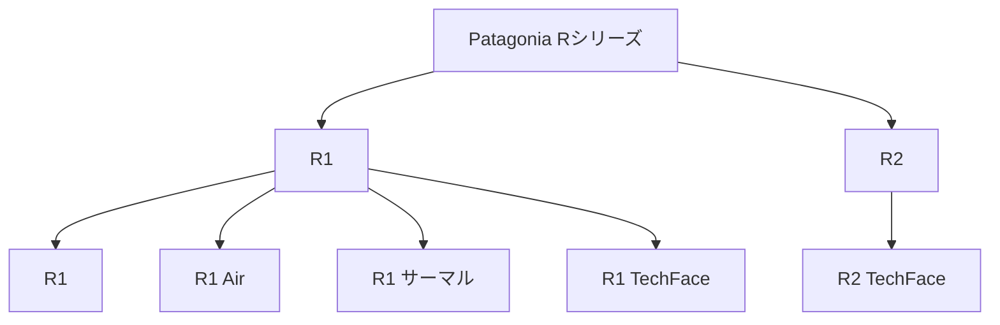

---
# Feel free to add content and custom Front Matter to this file.
# To modify the layout, see https://jekyllrb.com/docs/themes/#overriding-theme-defaults
title: Patagonia フリース Rシリーズ レビュー
layout: single
date:   2025-9-14 21:00:00 +0900
categories: outdoor
tags:
 - item
 - Patagonia
header:
  teaser:
description: 2024秋シーズンに，秋冬のアウトドアや日常使いに向けてPatagoniaの定番フリース「Rシリーズ」から4点を購入したので比較レビュー．
---

2024秋シーズンに，秋冬のアウトドアや日常使いに向けてPatagoniaの定番フリース「Rシリーズ」から以下の4点を購入した．

- **R1 Air Crew**
- **R1 サーマル Crew**
- **R1 サーマル ジャケット**
- **R2 テックフェイス プルオーバー**

まとめて4つも同系統の服を購入するのも珍しいので比較レビューを残しておく．



## Rシリーズの概要

そもそもPatagoniaのRシリーズとはなんぞやというところを軽く紹介しておく．Patagoniaはフリースを数多く出しているが，そのうちアウトドア用に性能や使い勝手をチューニングしているのがテクニカルフリースで，Rシリーズはテクニカルフリースのロングセラーである．2000年ごろから売っていたらしい．「R」はRegulatorの略で，つまり保温性と通気性のバランスをとり行動中の体温調節をサポートするようなところをコンセプトにしている．

現在は，通常のR1シリーズと，より保温性を重視して厚いR2シリーズの二シリーズが展開されている．さらに細かい用途に応じて以下の4つのラインがある．

| ライン         | 概要                                                                                                           |
|----------------|----------------------------------------------------------------------------------------------------------------|
| 通常           | 一番汎用性がある通常ライン．                                                                                   |
| エアー         | 一番薄いライン．中空糸をジグザグ構造で仕上げたニットが、温かさを閉じ込めながら余分な熱は発散                   |
| サーマル       | 一番暖かいライン．丈夫な外側がちょっとした天候の変化に対応し、ソフトなマイクログリッドの内側が保温性を促進．   |
| テックフェイス | 外側の耐摩耗性に優れたライン．ソフトシェル・ジャケットの耐摩耗性と悪天候に対応する機能を備えた頑丈なフリース。 |

形態としても通常のジャケットやフーディの他，クルーネックやプルオーバー，ベストも用意されており，この3つのカテゴリで商品を見るとわかりやすい．ちなみにボトムスもあるが今回は取り扱わない．

2025年2月現在のラインナップは以下の通りだ．おそらく毎シーズン更新されるので最新情報は公式サイトを確認すること．

| カテゴリ | ライン         | 形態         | 製品名                        | 概要                                   |
|----------|----------------|--------------|-------------------------------|----------------------------------------|
| R1       | 通常           | ジャケット   | R1ジャケット                  |                                        |
|          |                | ベスト       | R1ベスト                      | Rシリーズ唯一のベスト                  |
|          |                | プルオーバー | R1プルオーバー                |                                        |
|          |                | プルオーバー | R1プルオーバーフーディ        |                                        |
|          | エアー         | クルー       | R1エアー クルー               | 普通のインナータイプ                   |
|          |                | フルジップ   | R1エアージャケット            |                                        |
|          |                | フルジップ   | R1エアー フルジップフーディ   |                                        |
|          | サーマル       | クルー       | R1サーマル クルー             | 普通のインナータイプ                   |
|          |                | フルジップ   | R1サーマル フルジップフーディ | フード付きだが腰位置のポケットがない． |
|          |                | ジャケット   | R1サーマルジャケット          |                                        |
|          | テックフェイス | フルジップ   | R1テックフェイスフーディ      |                                        |
|          |                | フルジップ   | R1テックフェイスジャケット    |                                        |
| R2       | テックフェイス | フルジップ   | R2テックフェイス フーディ     |                                        |
|          |                | ジャケット   | R2テックフェイスジャケット    |                                        |
|          |                | プルオーバー | R2テックフェイス プルオーバー |                                        |

今回購入したのは以下の4点で，いずれも登山やアウトドア用途で購入した．Crewとプルオーバーは脱がない場面で重宝する一方，ジャケットは通常のミドルウェアとして利用できる．ミドルウェアは別に化繊もいくつか持っているので今回はCrewを厚めに購入した．

- R1 Air Crew
    - 寒い場面で，ベースレイヤー+本品を脱がずに行動する想定
- R1 サーマル Crew
    - 寒い場面で，ベースレイヤー+本品を脱がずに行動する想定
- R1 サーマル ジャケット
    - 通常のミドルウェアとして．化繊とどちらが良いか見極めたいというのもある．
- R2 テックフェイス プルオーバー
    - これは登山よりはあまり行動しないアウトドアで使う目的．

以下順番に紹介していこう．

## R1 Air Crew

> R1エア・クルーは軽量で通気性と速乾性を備え、寒冷な状況での激しい運動に最適なテクニカル・フリース。活動中も快適さを保つ構造のリサイクル・ポリエステル100％素材を使用。
> 

- 素材：中空糸を使用した5.7オンス・リサイクル・ポリエステル100％のジャカード・フリース
- 重量：約275g
- 特徴：通気性・速乾性・軽量性に特化



R1 Airシリーズは，ジグザグ構造の特殊な仕上げになっており，これがかなり見た目に影響をしている．この仕上げによってシリーズ中最も通気性がよくなっている（要は薄い）とのことだ．



実際に使ってみるととにかくフリースにしては軽いのと，通気性が良いおかげで行動量が多くても全く蒸れない．

Patagoniaのテクニカル系統の服は本シリーズに限らず着心地が良いものが多く，本品も例外ではなく着心地が良い．直接肌に触れても全然不快感がないので，半袖の上に着たり，登山以外に日常ちょっと寒い日とかにも使っていけると思った．ただしその場合はその特殊すぎる見た目が気になるかもしれないが．．．



一方で，欠点というか製品の特性上しょうがないのだが，防風性がほぼないため風のある稜線上ではさらに上からウィンドシェルやジャケットを着用する必要がある．



## R1 サーマル Crew

> R1サーマル・クルーは運動中の体を外的要素から温かく守る、極寒の高山での課題に最適なテクニカル・フリース。内側はソフトで温かいマイクログリッドの裏打ちが通気性を発揮し、外側は丈夫で滑らかな表面素材が風や小雪を弾いて天候の変化にも対応。
> 
- 素材：6.5オンス・リサイクル・ポリエステル91％／ポリウレタン９％のフラットフェイス・テクノストレッチ・フリース
- 重量：約335g
- 特徴：保温性に特化．



R1シリーズで最も暖かいラインではありながら，R2テックフェイスよりは一回り薄く，あくまで行動着として設計されている．見た目もあまりフリース感がなく落ち着いている．



特徴的なのは保温性を上げるための裏面のマイクログリッド構造で，R1 Airと比べると差がわかりやすい．このおかげで保温性に関してはR1 Airと比べると断然暖かいので，ちょっと寒いくらいの日に着ていくとオーバースペックだ．後述するジャケットは前面のジップで調整できるのだがクルータイプはそれができないため，ジャケットタイプより一段暖かいと思っておくとよさそうだ．とはいえ本品も通気性がかなりよくてオーバーヒートしにくいのが非常に良い．気温やシチュエーションでR1エアーと使い分けられる．



肌触りも非常に滑らかで，着心地は快適だ．かなり暖かいので冬の日常着としてかなり良いのではないかと思う．　内側のマイクログリッドは触るとフカフカで気持ちが良い．



R1サーマルは厚いのと表面の生地もしっかりしているためか，多少の風ならシェルジャケットなしでも行動できた．

## R1 サーマル ジャケット

> R1サーマル・ジャケットは運動中の体を外的要素から温かく守る、極寒の高山での課題に最適なテクニカル・フリース。内側はソフトで温かいマイクログリッドの裏打ちが通気性を発揮し、外側は丈夫で滑らかな表面素材が風や小雪を弾いて天候の変化にも対応。
> 
- 素材：6.5オンス・リサイクル・ポリエステル91％／ポリウレタン９％のフラットフェイス・テクノストレッチ・フリース
- 重量：約411g
- 特徴：保温性に特化．





R1サーマルのジャケットバージョン．最初はフーディタイプを買おうと思っていたのだが，いざ店舗に行ってみてみると，フーディタイプはクライミングなどを想定しているらしく（店員談），腰位置のポケットがなかった．．．これでは使いにくいということでポケットのあるジャケットを購入した．オンラインで買う時は注意して欲しい．

着心地はR1サーマル Crewをそのままジャケットにしたものだ．通常のミッドレイヤーとして使えるか知りたくて購入した．実際使ってみるとかなりよく，化繊ジャケットの代替としても使っていけそうだ．前述の通りこの手のフリースにしは相当蒸れにくく，クルータイプに比べてジップでの調節もしやすい．





ただしミッドレイヤーとして考えた場合，通常の化繊ジャケットに比べると防風性や耐候性の面で難があるため，その面でどちらをとるかを考えることになるだろう．

## R2 テックフェイス プルオーバー

> より涼しい気温のためにデザインされたR2テックフェイス・プルオーバーは、ウェーダーの下に着用する中厚レイヤーとして最適ながら釣りの後にくつろぐときも快適な多用途型。内側は温かいグリッド構造のフリースで、摩擦に耐える補強を施した外側は水を弾くDWR（耐久性撥水）加工済み。さまざまな目的に応じるポケット、まち付きの袖、フードを備えたデザイン。
> 
- 素材：本体：通気性を備えたストレッチダブル織りの6.8オンス・リサイクル・ポリエステル93％／ポリウレタン７％（後染め）または7.9オンス・リサイクル・ポリエステル92％／ポリウレタン８％（原料染め：BLKのみ）のR2テックフェイス素材。PFASを意図的に使用せずに製造されたDWR（耐久性撥水）加工済み
- 素材：補強のパネル：プラスチック汚染の危機にさらされている沿岸部の共同体から供給された、オーシャンサイクルの認証済みのストレッチ平織りの3.9オンス・リサイクル・ポリエステル86％／ポリウレタン14％。PFASを意図的に使用せずに製造されたDWR加工済み。ブルーサインの認証済み。フェアトレード・サーティファイドの工場で製造
- 重量：約480g
- 特徴：保温性と耐候性に優れる．



テックフェイスのプルオーバーは，登山ではなく寒い時のアウトドアアクティビティや旅行を考えて購入した（ので登山には着て行ってない）．R2はR1と比べても格段に重くて暖かい．とはいえ，テックフェイスは防風性込で考えて作られている感があり，保温性自体はそこそこという感想だ．R1と比べると段違いに温かいのだが，本当に寒いときにはこれだけだと不安，というような感じ．もし保温性を求めるならば素直に密度があり毛先の長いフリースを買ったほうが良い．登山だと冬の低山にはオーバースペックだが雪山にはちょっと心もとないような気がするので，私には使い所が難しそうである．寒がりの人にはちょうど良いかもしれない．



表面に耐摩耗性に強い加工が施されており，フリースよりもソフトシェルに近い感覚だ．耐候性については，防風性はピカイチでアウター不要で使える．また，この防風性のおかげで体感気温が下がりにくく，結果して普通のフリースを着ているより暖かく感じる．雨についても小雨程度ならば全然大丈夫なのでアウトドアでの信頼性は抜群だと思う．

欠点としては重く嵩張ることがあげられる．重量は500mlペットボトルに近く，表面加工のせいであまり小さくたたむことができない．





## まとめ

PatagoniaのRシリーズを4種類まとめ買いしたが，どのラインナップも役割が明確で使い分けていけそうだ．

Patagonia以外の他の製品との比較もできる範囲でやっておこう．私が所持している他の唯一のフリースはArcteyxのデルタ LT（10年くらい前のやつ，未だ現役！フリースはめちゃくちゃ耐久性ある）だが，暖かさの比較はR1 エア < Gamma LT << R1 サーマルといったところ．R1 エアとGamma LTは比較的コンセプトが近く，使えるシーンも似通っていると思う．一方R1 サーマルはより暖かいので使うシーンが異なる．今までGamma LTは夏の高山や秋口などで重宝していたが，R1エアクルーはこれらの場面に加えて，クルータイプであることを活かして冬にも活用できそうなので汎用性が高いと感じる．

化繊ミッドレイヤーとしてはArcteryxのアトムとプロトンを愛用しているが，R1サーマルジャケットの保温性はこれらよりもさらに低く，一方通風性に優れる，といった位置付けだ．プロトンは化繊にしては通風性が良いので行動中もずっと脱がずに動いていける上，ソフトシェル的な使い方もできるので気に入っている．R1サーマルも行動中にずっと来ていられる通風性を持っている一方で防風等は比較して劣るため，登山に持っていく場合は別途アウターが欲しくなる．使い分けとしてはアウターなしでも大丈夫な場合にプロトンを用いて，R1サーマルはより気温の高い日にアウターは別で用意して使うのが良さそうだ．

## TODO

- 写真の色転びがひどいので撮り直し．