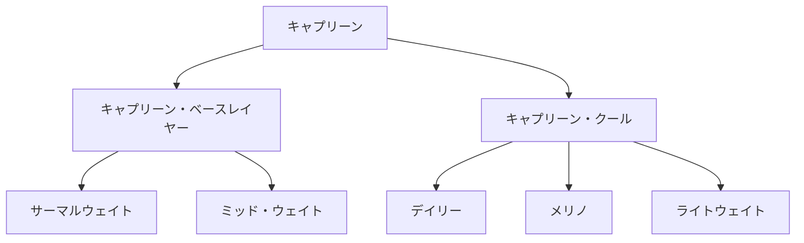

---
# Feel free to add content and custom Front Matter to this file.
# To modify the layout, see https://jekyllrb.com/docs/themes/#overriding-theme-defaults
title: Patagonia ベースレイヤー キャプリーンシリーズ レビュー
layout: single
date:   2025-10-13 21:00:00 +0900
categories: outdoor
tags:
 - item
 - Patagonia
header:
  teaser:
description: 新しいベースレイヤー，Tシャツとして，Patagoniaのキャプリーンからいくつか購入したのでレビューを残しておく．
---

新しいベースレイヤー，Tシャツとして，Patagoniaのキャプリーンからいくつか購入したのでレビューを残しておく．



## キャプリーンシリーズ概要

キャプリーン（Capilene）は、Patagoniaが展開する**ベースレイヤーのシリーズ**．ベースレイヤーならではの速乾性を持ちつつ，用途や季節に合わせて生地の厚みなどを選択できるので，最適な一枚が見つかるだろう．

シリーズは大別して「キャプリーン・ベースレイヤー」と「キャプリーン・クール」の二つがある．ベースレイヤーが秋冬用のもので保温性と透湿性を両立することを意識して作られている．縫製もグリッドパターンなどを採用しているのが特徴だ．バリエーションとしてジップネックやフード付きなどがある．クールは夏用のより薄いものでテクニカルTシャツと考えれば良い．長袖に加えて半袖も用意されている．さらにその中でも生地の厚さの違いでいくつかのバリエーションがある．

ラインナップはベースレイヤーは2種類，クールは3種類ある．ベースレイヤーはより厚いサーマルウェイトと薄めのミッドウェイト．クールは厚さ違いでデイリーとより薄いライトウェイト，さらに素材にメリノウールを混縫したメリノが存在する．あとはフードの有無やデザイン（柄がプリントされていたり）で細かく商品名が異なったりするが，そこは細かすぎるので今回は触れない．

厚さは大体以下のように理解すれば分かりやすいだろう．

ベースレイヤー・サーマルウェイト>ベースレイヤー・ミッドウェイト>クールデイリー>クールライトウェイト

個人的には秋冬の低山にはミッドウェイト，夏場の暑い日はクールデイリーでちょうど良いくらいの厚さになっていると思う．

各アイテムの特徴を表にまとめた．

| シリーズ       | モデル               | 特徴                               | 素材                                                                                                                                                       | おすすめシーン                     | 半袖/フード/ジップネック     |
|----------------|----------------------|------------------------------------|------------------------------------------------------------------------------------------------------------------------------------------------------------|------------------------------------|------------------------------|
| クール         | **デイリー**         | 普段着感覚で着られる万能Tシャツ    | 3.7オンス・リサイクル・ポリエステル100％                                                                                                                   | 夏の普段着、登山など万能           | フード（長袖），長袖，半袖， |
| クール         | **ライトウェイト**   | シリーズ最軽量。速乾性抜群         | 2.3オンス・リサイクル・ポリエステル100％                                                                                                                   | 真夏の登山など                     | 長袖，半袖                   |
| クール         | **メリノ**           | メリノウール混紡で少し厚め．       | 3.5オンス・レスポンシブル・ウール・スタンダード（RWS）認証済み（Control Unionによる認証TE-00052557）ウール65％／リサイクル・ポリエステル35％のジャージー。 | スリーシーズンの登山               | 長袖，半袖，                 |
| ベースレイヤー | **ミッドウェイト**   | 保温と通気のバランスのよい冬の定番 | ダイアモンド型のグリッド・パターンを備えた4.3オンス（147グラム）・リサイクル・ポリエステル100％のダブルニット                                              | 秋冬の登山                         | クール，ジップネップ         |
| ベースレイヤー | **サーマルウェイト** | 最も厚手。極寒対応                 | 3.8オンス（129グラム）・ポーラテック・パワー・グリッド・リサイクル・ポリエステル92％／ポリウレタン８％のジャージー                                         | 厳冬期登山、雪山キャンプ、冬スキー | クルー，フード，ジップネック |
|                |                      |                                    |                                                                                                                                                            |                                    |                              |

今回購入したのはクール・デイリー，ベースレイヤー・ミッドウェイト，ベースレイヤー・サーマルウェイトの3つ．前者二つは登山で使う用途で，サーマルウェイトはより強度の低いアクティビティで使う用に購入した．

## クール・デイリー

> トレイルから水辺までパタゴニア製品の中で最も多用途に使えるテクニカル・トップ。速乾性を備え、伸縮性により動きやすく快適で、さわやかな着心地を長く保つハイキュ・ミント防臭加工済み。キャプリーン・クール・デイリー・スタイルは冷涼から暑熱におよぶ状況で激しく運動しているときも体を快適に保つデザイン。リサイクル成分を50〜100％含むポリエステル素材を使用し、フェアトレード・サーティファイドの工場で製造
> 

クールデイリーはザ・テクニカルTシャツのイメージそのままの商品だ．薄い生地と高い速乾性で機能面は十分な一方で，見た目はあまりスポーティすぎずに日常でも使いやすい．素材はポリエステル100%で，メリノウール混紡のクール・メリノと差別化されている．



生地はこの手のテクニカルTシャツとしては標準的な薄さ．今年のような殺人的な熱さにちょうど良い．本品で特筆すべきは生地の肌触りの良さだと思う．この手のテクニカルTシャツは性能全振りで着心地がよくないものも存在するが，本品は普通の綿生地のシャツと似たような滑らかさで着心地が良い．そのため日常使いもしやすく今年の夏は多くの時間をこのシャツで過ごした．逆にテクニカルTシャツらしく，秋口になってきたらもう薄すぎて着れない（か上着が必須になる）ので夏場専用のTシャツとして割り切るのが良いだろう．



また，「ハイキュ・ミント防臭加工」なる加工がされているらしく，防臭性能があるとのこと．1日の登山では使っていて臭いが気になるような場面はなかった．縦走でどうなるかは今後機会をみて試してみたいところ．また，乾くのも早くて汗染みも出来にくいのでその点も使いやすいと感じた．



今年は残念ながら真夏にアルプスに行くことができなかったので高山で使ってみてどういう感じかわからないのだが，低めの山で試した感じは秋口まで広くお勧めできる商品になっていると思う．

## キャプリーン・ミッドウェイト

> リサイクル・ポリエステル100％素材を使用した定番の万能型ベースレイヤー。ソフトで滑らかな表面はレイヤリングしやすく、中空糸とダイアモンド型のグリッド・パターンを備えた裏面は保温性、吸湿発散性、速乾性を提供。さわやかな着心地を保つハイキュ・ミント防臭加工済み。フェアトレード・サーティファイドの工場で製造
> 

ミッドウェイトはクールデイリーと異なり秋冬用の保温に重点を置いたベースレイヤーで，これからの季節で活躍する品だ．秋冬用のベースレイヤーは，各社保温性と透湿性を確保するためにいろいろ工夫をしており，本品も例外ではない（逆にいうと，単に防寒したい場合にはあまり向かない）．100%のポリエステル生地にフリースのようなグリッド構造を採用して保温と通気のバランスを取っている．



表面，裏面ともに目でもわかりやすいグリッド構造になっている．





クールデイリーと比較すると生地感の違いがわかりやすい．また，クールデイリーとの違いとしてフィット感が微妙に違う．イメージとしてはクールデイリーは日常使いも意識してかレギュラーフィット，ミッドウェイトはレイヤリングを意識してかスリムフィットになっている．私はクールデイリーはS，ミッドウェイトはMでちょうど好みのサイズだった．なので可能なら試着したほうが良いだろう．



細かい工夫だが，袖口には親指に挟めるループが付いていて，手に固定できるようになっている．私は使わないが，ロッククライミングなど腕を上げることが多いシーンでは有効に活用できるだろう．



厚さや暖かさは標準的な秋冬のベースレイヤーと思って良い．クールデイリー同様に着心地が良いのがさすがパタゴニアと感じる．普通に使いやすいのだが，このクラスのベースレイヤーは各社力を入れて良いものを出しているので本品が突出して良いという感じはあまり感じない．

## キャプリーン・サーマルウェイト

> 通気性を備え、寒いコンディションでは保温性を提供するフーディ。お気に入りのテクニカルTシャツの上にレイヤリングするスタイル。ポーラテック・パワー・グリッド素材を使用し、さわやかな着心地を保つハイキュ・ピュア防臭加工済み。フェアトレード・サーティファイドの工場で製造
> 

サーマルウェイトはミッドウェイトよりもさらに暖かいベースレイヤーだ．素材もポーラテックのグリッド素材を利用している．イメージとしては超薄いフリースをベースレイヤーとして着るのが近いかもしれない．とはいえ同じくパタゴニアのフリースであるR1エアー（278g）よりは断然薄いのでそこは用途によって使い分けが必要だ．





右がサーマルウェイト，左がR1エアー．写真だとわかりにくいが体感R1の方が1.5倍くらい厚い．

本品，素材のおかげか147gとめちゃくちゃ軽く，より薄いミッドウェイト（176g）よりも軽い．暖かいベースレイヤーながら着る負担が軽いのが良い．着心地もフリース譲りで非常によく，長時間来ていても快適だ．ミッドウェイトと同じく生地はグリッド構造になっているが見た目は少し異なる．



右からサーマルウェイト，ミッドウェイト，クールデイリー．サーマルウェイトも袖口に親指ループが付いている．

生地の内側を見るとグリッド構造なのが非常にわかりやすい．黒い部分はポケットの内あてだ．着心地は非常によく，肌に直接来ても全く問題ない．



サーマルウェイトは手元にポケットがついている．レイヤリングするときには不要だが単体で使うときは便利かもしれない．



サーマルウェイトの一番の欠点はその値段だろう．ミッドウェイトよりさらに高価で少し上を見ればR1エアーが控える価格帯なので，暖かさを求めるなら素直にR1エアーを買った方が良さそうだ．

## シーン別の使い分け

シリーズの各種でキャラが立っているのであまり悩むことはないと思うが個人的な使い分けについて示しておこう．

- クールデイリー
    - 季節：夏，春秋はレイヤリングが必要
    - 用途：夏山登山，デイリーユース，ランニングなど万能に使える
- ミッドウェイト
    - 季節：秋冬春
    - 用途：秋以降の低山用のベースレイヤー，春秋の高山のベースレイヤー
- サーマルウェイト
    - 季節：秋冬春
    - 用途：秋以降の低山用のベースレイヤー（より寒い場合），秋冬の運動量の低いアウトドア

## まとめ

今回パタゴニアのキャプリーンシリーズから3つ購入してみたが，いずれも非常に高品質で使いやすいシャツ・ベースレイヤーだった．特に他社比較で優れている感じたのは着心地の良さで，テクニカル服らしからぬ柔らかさで長時間来ていても不快感がない．シリーズで揃えると様々なシーンに対応できるので，検討してみると良いと思う．